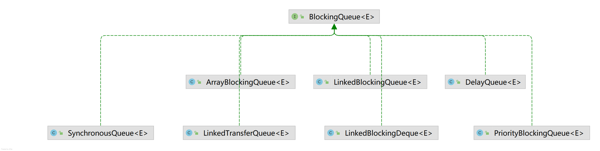
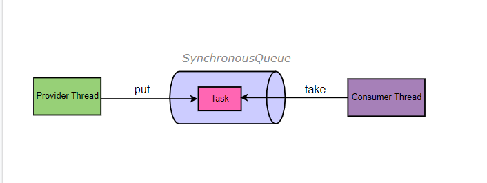

## 手动创建线程池  

### 任务队列  
  

#### ArrayBlockingQueue  
采用数组来实现,并采用可重入锁ReentrantLock来做并发控制，无论是添加还是读取，都先要获得锁才能进行操作
可看出进行读写操作都使用了ReentrantLock，ArrayBlockingQueue需要为其指定容量
```
    public boolean offer(E e) {
        checkNotNull(e);
        final ReentrantLock lock = this.lock;
        lock.lock();
        try {
            if (count == items.length)
                return false;
            else {
                enqueue(e);
                return true;
            }
        } finally {
            lock.unlock();
        }
    }
    
    public void put(E e) throws InterruptedException {
        checkNotNull(e);
        final ReentrantLock lock = this.lock;
        lock.lockInterruptibly();
        try {
            while (count == items.length)
                notFull.await();
            enqueue(e);
        } finally {
            lock.unlock();
        }
    }
```
#### SynchronousQueue  
由于SynchronousQueue源码比较复杂，里面大量的Cas操作，SynchronousQueue没有容器，所以里面是装不了任务的，当一个生产者线程生产一个任务的
时候，如果没有对应的消费者消费，那么该生产者会一直阻塞，知道有消费者消费为止。  
图示：  

如下代码，如果我们将消费者线程注释掉执行，那么生产者哪里将会一直阻塞

```
package thread.customthreadpool;

import java.util.concurrent.ExecutorService;
import java.util.concurrent.Executors;
import java.util.concurrent.SynchronousQueue;
import java.util.concurrent.ThreadPoolExecutor;

/**
 * 测试SynchronousQueue
 */
public class SynchronousQueueTest {

    private static final SynchronousQueue<String> synchronousQueue = new SynchronousQueue<>();

    private static final ExecutorService service = Executors.newCachedThreadPool();

    public static void main(String[] args) {
        /**
         * Provider
         */
        service.submit(() -> {
            try {
                synchronousQueue.put("liu");
            }catch (Exception e){
                e.printStackTrace();
            }
            System.out.println("Consumer finished spending");
        });

        /**
         * Consumer
         */
        service.submit(() ->{
            try {
                synchronousQueue.take();
            }catch (Exception e){
                e.printStackTrace();
            }
            System.out.println("take over");
        });
    }
}

```

#### LinkedBlockingDeque  
LinkedBlockingDeque是一个双向队列，底层使用单链表实现，任何一段都可进行元素的读写操作，在初始化LinkedBlockingDeque的时候，
我们可以指定容量，也可不指定，如果不指定，则容量为Integer.MAX_VALUE，
##### 注：Deque是双端队列，而Queue是单端队列，双端意思是两端都可以进行读写操作，而单端则只能从一端进，一端出（FIFO）
```
    public LinkedBlockingDeque() {
        this(Integer.MAX_VALUE);
    }
```

```
package thread.customthreadpool;
import java.util.concurrent.LinkedBlockingDeque;
public class LinkedBlockingDequeTest {

    private static final LinkedBlockingDeque<Integer> deque = new LinkedBlockingDeque<>();

    public static void main(String[] args) throws InterruptedException {
        deque.put(1);
        deque.put(2);
        deque.put(3);
        deque.put(4);
        deque.put(5);
        System.out.println(deque);
        System.out.println("deque size  "+deque.size());
        deque.take();
        deque.take();
        deque.take();
        deque.take();
        deque.take();
        System.out.println(deque);
        System.out.println("deque size  "+deque.size());
    }
}

```
  


#### LinkedBlockingQueue
底层基于单向连表实现，是一个单向队列，具有先进先出(FIFO)特点，使用了ReentrantLock来做并发控制,读写操作都上锁

```
private final ReentrantLock putLock = new ReentrantLock();
```

```
    public void put(E e) throws InterruptedException {
        if (e == null) throw new NullPointerException();
        int c = -1;
        Node<E> node = new Node<E>(e);
        final ReentrantLock putLock = this.putLock;
        final AtomicInteger count = this.count;
        putLock.lockInterruptibly();
        try {
            while (count.get() == capacity) {
                notFull.await();
            }
            enqueue(node);
            c = count.getAndIncrement();
            if (c + 1 < capacity)
                notFull.signal();
        } finally {
            putLock.unlock();
        }
        if (c == 0)
            signalNotEmpty();
    }
```

```
    public E take() throws InterruptedException {
        E x;
        int c = -1;
        final AtomicInteger count = this.count;
        final ReentrantLock takeLock = this.takeLock;
        takeLock.lockInterruptibly();
        try {
            while (count.get() == 0) {
                notEmpty.await();
            }
            x = dequeue();
            c = count.getAndDecrement();
            if (c > 1)
                notEmpty.signal();
        } finally {
            takeLock.unlock();
        }
        if (c == capacity)
            signalNotFull();
        return x;
    }
```

