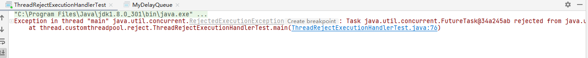

## 线程池之拒绝策略  
当线程池中任务队列已满且最大线程数maximumPoolSize达到最大，那么将会触发拒绝策略  

线程池一共内置了四种拒绝策略,线程池默认使用AbortPolicy，

##### ThreadPoolExecutor.AbortPolicy()  
丢弃任务并抛出RejectedExecutionException异常  
```
 public static class AbortPolicy implements RejectedExecutionHandler {
        public AbortPolicy() { }
        public void rejectedExecution(Runnable r, ThreadPoolExecutor e) {
            throw new RejectedExecutionException("Task " + r.toString() +
                                                 " rejected from " +
                                                 e.toString());
        }
    }
```



##### ThreadPoolExecutor.DiscardPolicy()  
丢弃任务，但是不抛出异常。
```
    public static class DiscardPolicy implements RejectedExecutionHandler {
        public DiscardPolicy() { }
        public void rejectedExecution(Runnable r, ThreadPoolExecutor e) {
        }
    }
```

##### ThreadPoolExecutor.DiscardOldestPolicy()  
丢弃队列最前面的任务，然后重新提交被拒绝的任务,e.getQueue().poll()将最前面的任务弹出

```
   public static class DiscardOldestPolicy implements RejectedExecutionHandler {
        public DiscardOldestPolicy() { }

        public void rejectedExecution(Runnable r, ThreadPoolExecutor e) {
            if (!e.isShutdown()) {
                e.getQueue().poll();
                e.execute(r);
            }
        }
    }
```

##### ThreadPoolExecutor.CallerRunsPolicy()  
由调用线程（提交任务的线程）处理该任务

```
   public static class CallerRunsPolicy implements RejectedExecutionHandler {
        public CallerRunsPolicy() { }
        public void rejectedExecution(Runnable r, ThreadPoolExecutor e) {
            if (!e.isShutdown()) {
                r.run();
            }
        }
    }
```

##### 自定义拒绝策略  
当上面拒绝策略不能满足我们的需求，我们需要自定义拒绝策略，只需要实现RejectedExecutionHandler就行

```
package thread.customthreadpool.reject;

import java.util.concurrent.RejectedExecutionException;
import java.util.concurrent.RejectedExecutionHandler;
import java.util.concurrent.ThreadPoolExecutor;

/**
 * 自定义拒绝策略
 */
public class MyThreadRejectExecutionHandler implements RejectedExecutionHandler {
    @Override
    public void rejectedExecution(Runnable r, ThreadPoolExecutor executor) {
        /**
         * 加入自己的处理逻辑
         */
        throw new RejectedExecutionException("请求异常");
    }
}

```

