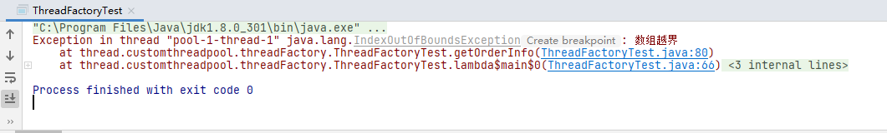
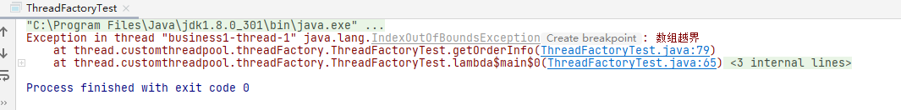

## 线程工厂ThreadFactory  
我们在项目开发额过程中，如果有很多地方使用多线程，那么给线程命名是十分有必要的,这样当出现问题的时候就比较容易排查  

#### 创建线程池，使用默认的线程工厂
```
    /**
     * 创建线程池
     */
    public static final ThreadPoolExecutor pool =
            new ThreadPoolExecutor(
                    20,
                    100,
                    5,
                    TimeUnit.SECONDS,
                    new ArrayBlockingQueue<>(100)
            );
```

##### 测试
```
    public static void main(String[] args) {
        pool.execute(() -> {
            Integer integer = getOrderInfo();
            System.out.println(integer);
        });
        pool.shutdown();
    }

    private static Integer getOrderInfo(){
        try {
            List<Integer> list = new ArrayList<>();
            for (int i = 0 ; i < 10 ; i++){
                list.add(i);
            }
            return list.get(11);
        }catch (Exception e){
            throw new IndexOutOfBoundsException("数组越界");
        }
    }
```
上面程序发生异常，数组下标越界，我们发现线程的名称是pool-1-thread-1，pool代表是哪一个线程池，如果再启动一个线程池
就是pool-2,一直按照3,4,5,一直递增,thread-1则是线程,也是递增,thread-2,thread-2,但是当我们系统业务复杂，服务很多，
根据这个报错很难找出是哪里的问题。



#### 为线程设定名字  
我们首先看一下默认的ThreadFactory，
```
    static class DefaultThreadFactory implements ThreadFactory {
        private static final AtomicInteger poolNumber = new AtomicInteger(1);
        private final ThreadGroup group;
        private final AtomicInteger threadNumber = new AtomicInteger(1);
        private final String namePrefix;

        DefaultThreadFactory() {
            SecurityManager s = System.getSecurityManager();
            group = (s != null) ? s.getThreadGroup() :
                                  Thread.currentThread().getThreadGroup();
            namePrefix = "pool-" +
                          poolNumber.getAndIncrement() +
                         "-thread-";
        }

        public Thread newThread(Runnable r) {
            Thread t = new Thread(group, r,
                                  namePrefix + threadNumber.getAndIncrement(),
                                  0);
            if (t.isDaemon())
                t.setDaemon(false);
            if (t.getPriority() != Thread.NORM_PRIORITY)
                t.setPriority(Thread.NORM_PRIORITY);
            return t;
        }
    }
```
不难看出在无参构造函数中使用了pool-作为前缀，那么这个我们可以自定义为自己的业务名称，ThreadFactory是一个接口，我们
实现它，并根据自己的需求去改就行，如下：  

##### 我们在构造函数中传了一个threadName，然后拼接成我们想要的
```
package thread.customthreadpool.threadFactory;

import java.util.concurrent.Executors;
import java.util.concurrent.ThreadFactory;
import java.util.concurrent.atomic.AtomicInteger;

/**
 * 自定义线程工厂
 *
 * 线程工厂可以设置线程信息
 */
public class MyThreadFactory implements ThreadFactory {
    private static final AtomicInteger poolNumber = new AtomicInteger(1);
    private final ThreadGroup group;
    private final AtomicInteger threadNumber = new AtomicInteger(1);
    private final String namePrefix;

    /**
     * 构造函数传入我们想业务需要的线程名字threadName，方便发生异常是追溯
     * @param threadName
     */
    public MyThreadFactory(String threadName) {
        SecurityManager s = System.getSecurityManager();
        group = (s != null) ? s.getThreadGroup() :
                Thread.currentThread().getThreadGroup();
        if (threadName == null || threadName.isEmpty()){
            threadName = "pool";
        }
        namePrefix = threadName +
                poolNumber.getAndIncrement() +
                "-thread-";
    }

    public Thread newThread(Runnable r) {
        Thread t = new Thread(group, r,
                namePrefix + threadNumber.getAndIncrement(),
                0);
        if (t.isDaemon())
            t.setDaemon(false);
        if (t.getPriority() != Thread.NORM_PRIORITY)
            t.setPriority(Thread.NORM_PRIORITY);
        return t;
    }
}

```
##### 然后将其加入线程池  
```
    /**
     * 创建线程池
     */
    public static final ThreadPoolExecutor pool =
            new ThreadPoolExecutor(
                    20,
                    100,
                    5,
                    TimeUnit.SECONDS,
                    new ArrayBlockingQueue<>(100),
                    new MyThreadFactory("business")
            );
```
当发生异常时，我们就能清晰的看到是哪一个模块的问题，能够快速的去排查

