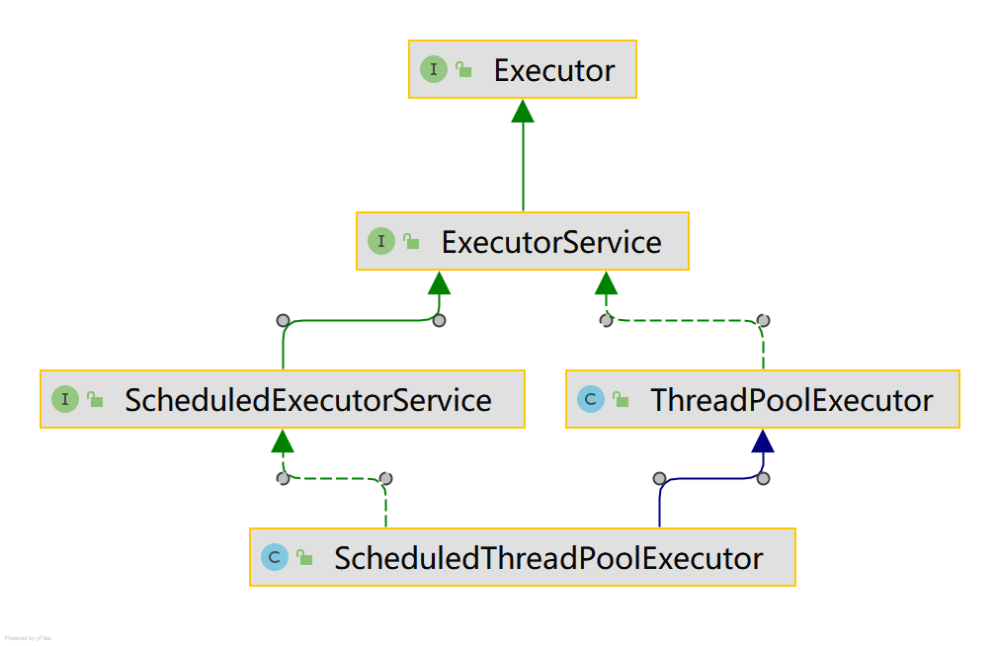

## 定时线程池  
使用定时线程池，我们可以做一些定时任务，我们可以使用内置的定时线程池，也可以通过ScheduledThreadPoolExecutor来手动创建，
ScheduledExecutorService继承自ExecutorService,通过Executors.newScheduledThreadPool(core)便可以创建，
ScheduledThreadPoolExecutor是ThreadPoolExecutor的子类，继承ScheduledExecutorService，


#### 创建一个定时线程池  
如果使用内置的线程池，那么核心线程数由我们设置，其他的则不能由我们设置,最大线程数为Integer.MAX_VALUE，这样不合理
,
super(corePoolSize, Integer.MAX_VALUE, 0, NANOSECONDS, new DelayedWorkQueue(), threadFactory, handler);
```
    /**
     * 直接new一个内置的ScheduledExecutorService   
     */
    private static final ScheduledExecutorService schedule = Executors.newScheduledThreadPool(20);
    
     /**
     * 手动创建一个
     */
    private static final ScheduledThreadPoolExecutor poolExecutor = new ScheduledThreadPoolExecutor(20,
            new MyThreadFactory("business-thread"), new MyThreadRejectExecutionHandler());
```


